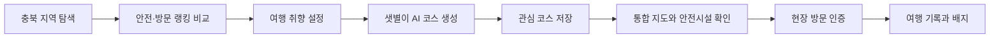
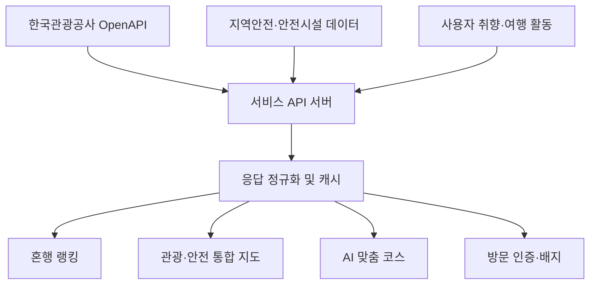

# 혼행등대

<p align="center">
  
</p>

<p align="center">
  <strong>혼자여도 괜찮은 충북 여행</strong><br />
  공공데이터와 AI를 활용해 안전한 여행지 탐색부터 맞춤 코스, 현장 기록까지 연결하는 충청북도 특화 혼행 서비스
</p>

## 서비스 소개

혼행등대는 혼자 여행할 때 생기는 세 가지 고민에서 출발했습니다.

- 어느 지역이 나에게 잘 맞는지 찾기 어렵습니다.
- 낯선 지역의 안전 정보를 한눈에 확인하기 어렵습니다.
- 관광지 정보는 많지만 실제 일정으로 만드는 데 시간이 오래 걸립니다.

혼행등대는 한국관광공사 OpenAPI의 관광·축제·방문 데이터를 지역안전 데이터 및 사용자 취향과 결합합니다. 사용자는 충북 11개 시군을 비교하고, AI 여행 도우미 **샛별이**에게 맞춤 코스를 추천받고, 지도에서 주변 관광지와 안전시설을 확인하며 여행을 기록할 수 있습니다.

> 서비스 범위는 충청북도 지역 특화입니다. 전국 정보를 얕게 나열하기보다 충북 11개 시군의 관광과 안전 정보를 하나의 여행 경험으로 촘촘하게 연결하는 데 집중합니다.

## 핵심 가치

| 가치 | 제공 방식 |
| --- | --- |
| 안심할 수 있는 목적지 선택 | 지역안전지수와 방문자 데이터를 결합한 충북 혼행 랭킹 |
| 취향에 맞는 여행 계획 | 여행 성향·동행 형태·이동 수단 등을 반영한 AI 코스 생성 |
| 현장에서 바로 쓰는 정보 | 현재 위치 기반 관광지·숙박·축제·안전시설 통합 지도 |
| 여행 이후에도 남는 경험 | 여행 기록, 방문 인증, 충북 11개 시군 배지와 관심 코스 |

## 주요 기능

### 1. 충북 혼행 탐색

- 청주시, 충주시, 제천시, 보은군, 옥천군, 영동군, 증평군, 진천군, 괴산군, 음성군, 단양군 지원
- 안전도·여행객 수를 활용한 `안전한 곳`, `인기 있는 곳`, `한적한 곳` 랭킹
- 시군별 관광지, 문화시설, 음식점, 숙박시설, 축제 정보
- 관광사진과 중심 관광지를 활용한 지역 상세 탐색

### 2. AI 여행 도우미 ‘샛별이’

- 자연어 질문을 이용한 충북 여행 상담
- 사용자의 여행 취향과 선택 지역을 반영한 당일치기·1박 2일 코스 생성
- 장소별 일정, 설명, 안전 팁 제공
- 비동기 요청 및 SSE 기반 결과 수신
- 다른 탭으로 이동하거나 백그라운드에서 돌아와도 진행 중인 요청 결과 복구
- 생성된 코스 저장 및 관심 코스 관리

### 3. 관광·안전 통합 지도

- 카카오맵 기반 위치 탐색
- 관광지, 문화시설, 음식점, 숙박, 축제 카테고리 필터
- 병원, 여성안심지킴이집, CCTV, 스마트 가로등 등 안전시설 표시
- 현재 지도 영역 재검색 및 키워드 장소 검색
- 지역안전 등급과 시설 상세·전화 연결 제공

### 4. 현장 안전 지원

- 현재 위치와 가까운 안전시설 안내
- 위급 상황에서 즉시 작동하는 반복 진동 비상벨
- 안전시설 전화 연결
- 위치 권한 거절·측위 실패·API 오류에 대한 안내와 재시도 제공

### 5. 여행 기록과 커뮤니티

- 사진을 포함한 여행 기록 작성·수정·삭제
- 기록 좋아요 및 댓글
- 게시물·댓글·사용자·AI 응답 신고
- 사용자 차단 및 신고 처리 결과 확인
- 다른 여행자의 충북 여행 경험 탐색

### 6. 방문 인증과 배지

- 관광지 300m, 축제 500m 이내에서 현장 방문 인증
- 위치 정확도가 낮을 때 인증을 중단해 오인증 방지
- 충북 11개 시군별 지역 배지
- 여행 코스 생성, 축제 방문, 여행 기록 등 활동 배지
- 정확한 현재 좌표 대신 기기에서 계산한 거리만 서버에 전송

## 사용자 흐름



## 공공데이터 활용

한국관광공사 OpenAPI는 단순 목록 노출이 아니라 목적지 비교, 지역 탐색, AI 코스 생성에 활용됩니다.

| 데이터 | 활용 화면 | 가공 및 활용 방식 |
| --- | --- | --- |
| 한국관광공사 지역 기반 관광정보 | 홈, 도시 상세, 지도, 장소 상세 | 충북 시군·콘텐츠 유형별 조회, 이미지 보유 관광지 선별, 지도 영역 필터링 |
| 한국관광공사 키워드 검색 | 통합 검색, 지도 검색 | 검색어 기반 관광 콘텐츠 탐색과 상세 연결 |
| 한국관광공사 행사 정보 | 홈, 도시 상세, 지도 | 종료된 행사를 제외하고 진행·예정 축제를 날짜순으로 제공 |
| 한국관광공사 숙박 정보 | 지도, AI 코스 | 주변 숙박시설 탐색과 일정 구성 후보로 활용 |
| 한국관광공사 관광사진 갤러리 | 홈, 갤러리 | 충북 및 시군 키워드 검색, 지역 탐색용 사진 콘텐츠 제공 |
| 지역 방문자 수 | 홈 혼행 랭킹 | 최근 집계일과 4주 전 같은 요일을 비교해 방문자 수·증감률·주민 대비 방문 비율 계산 |
| 기초지자체 중심 관광지 | 도시 상세 | 충북 시군별 방문 상위 관광지를 지역 소개에 활용 |
| 행정안전부 지역안전지수 | 홈, 도시 상세, 지도 | 범죄·생활안전·교통 지표를 혼행 관점으로 가공하고 기준연도와 함께 표시 |
| 안전시설 데이터 | 지도, 비상벨 | 현재 지도 영역 또는 가까운 충북 시군의 안전시설 조회 |

### 데이터 처리 흐름



서로 다른 API 응답은 클라이언트의 DTO·매퍼 계층에서 화면용 모델로 정규화합니다. 같은 데이터에 대한 중복 요청은 메모리 캐시로 줄이고, 지도 이동 중에는 자동 호출하지 않고 사용자가 `이 지역에서 재검색`을 선택했을 때 조회합니다.

## 충북 지역 특화 전략

혼행등대의 확장은 단순한 지역 수 확대보다 충북 여행 경험의 깊이를 높이는 데 초점을 둡니다.

- 충북 11개 시군별 혼행 코스와 지역 배지 고도화
- 축제·숙박·음식·안전시설을 연결한 체류형 여행 추천
- 시군별 관광 특성과 계절을 반영한 추천 정교화
- 방문 인증과 여행 기록을 활용한 재방문 동기 제공
- 지자체 및 지역 관광사업자와 연계 가능한 지역 콘텐츠 구조
- 사용자 피드백과 저장·방문 데이터를 활용한 추천 품질 개선

## 로그인 및 테스트

혼행등대는 **카카오 SNS 로그인**을 사용합니다.

- 카카오 계정으로 가입 및 로그인할 수 있습니다.
- 로그인 없이 `둘러보기(게스트 모드)`로 홈, 관광정보, 지도 등 주요 화면을 확인할 수 있습니다.
- AI 실시간 코스 생성, 관심 코스, 여행 기록, 방문 인증 등 개인화 기능은 카카오 로그인 후 이용할 수 있습니다.
- 게스트 모드의 AI 코스는 기능 이해를 위한 체험용 예시이며, 로그인 후에는 서버에서 맞춤 코스를 생성합니다.

권장 심사 동선은 다음과 같습니다.

1. 카카오 로그인 및 필수 약관 동의
2. 홈에서 안전·인기·한적 여행지 랭킹 비교
3. 충북 시군 선택 후 여행 취향 설정
4. 샛별이 AI 코스 생성 및 관심 코스 저장
5. 지도에서 관광지와 안전시설 확인
6. 여행 기록과 방문 배지 확인

## 기술 구성

| 영역 | 기술 |
| --- | --- |
| 앱 클라이언트 | React Native 0.86, React 19, TypeScript 5.8 |
| Android 빌드·실행 | Gradle, Hermes |
| 웹 클라이언트 | React Native Web, Vite |
| API 통신 | Axios, REST API, Server-Sent Events |
| 지도·인증 | Kakao Map, Kakao Login |
| 로컬 저장 | AsyncStorage |
| 위치·미디어 | Geolocation, Image Picker, WebView |

### 클라이언트 구조

```text
SoloTrav/
├─ App.tsx                 # 앱 진입점과 인증 컨텍스트
├─ src/
│  ├─ api/                 # API 요청, 엔드포인트, DTO, 응답 매퍼, SSE
│  ├─ auth/                # 카카오 로그인과 서비스 세션
│  ├─ navigation/          # 인증 게이트, 하단 탭, 화면 흐름
│  ├─ screens/             # 홈, 지도, 샛별이, 기록, 마이, SOS
│  ├─ travel/              # 관광·방문·안전 데이터 조회와 캐시
│  ├─ map/                 # 주변 관광지·축제·안전시설 조회
│  ├─ records/             # 여행 기록과 댓글 상태
│  ├─ favorites/           # AI 코스 관심 목록
│  ├─ badges/              # 방문 인증 배지
│  ├─ preferences/         # 사용자 여행 취향
│  ├─ components/          # 공통 UI 컴포넌트
│  └─ data/                # 충북 11개 시군 및 화면 기준 데이터
├─ android/                # Android 빌드 및 배포 설정
└─ web/                    # 동일 화면 코드를 사용하는 웹 클라이언트
```

## 실행 방법

### 요구 환경

- Node.js 22.11 이상
- Android Studio 및 Android SDK
- JDK 17
- 카카오 플랫폼 설정과 서비스 API 접근 권한

### 1. 의존성 설치

```bash
npm install
```

### 2. 환경변수 설정

`.env.example`을 복사해 `.env`를 생성합니다.

```bash
cp .env.example .env
```

```dotenv
API_BASE_URL=https://example.com/api
API_VERSION=v1
API_TIMEOUT_MS=15000
```

카카오 키와 Android 서명 정보는 저장소에 커밋하지 않고 로컬 설정으로 관리합니다.

### 3. 모바일 실행

Metro 개발 서버를 시작합니다.

```bash
npm start
```

별도 터미널에서 실행합니다.

```bash
# Android
npm run android
```

## 개발 명령어

| 명령어 | 설명 |
| --- | --- |
| `npm start` | Metro 개발 서버 실행 |
| `npm run android` | Android 앱 실행 |
| `npm run lint` | ESLint 정적 검사 |
| `npx tsc --noEmit` | TypeScript 타입 검사 |

## 안정성과 개인정보 보호

- API 액세스 토큰은 전용 저장 계층에서 관리하고 만료 시 세션을 갱신합니다.
- 인증 실패 시 무한 재요청을 방지하고 로그아웃·세션 복구 경로를 분리했습니다.
- AI 생성은 비동기 작업으로 접수하고 SSE 연결 실패 시 상태 조회로 결과를 복구합니다.
- 지도와 목록 요청은 취소 가능한 요청과 최신 요청 ID 검사를 사용해 오래된 응답이 화면을 덮지 않게 합니다.
- 안전시설별 부분 실패는 다른 시설 결과와 분리하며 사용자가 실패한 요청을 다시 시도할 수 있습니다.
- 방문 인증 시 정확한 사용자 좌표를 서버에 보내지 않고 관광지까지의 계산된 거리만 전송합니다.
- 회원 탈퇴, 신고, 사용자 차단과 같은 서비스 운영·보호 기능을 제공합니다.

## 현재 버전

- 앱 버전: `0.0.17`
- 주요 업데이트: 약관 및 개인정보 수집·이용 동의 절차 개선 및 세분화, 상세 확인 기능 개선

---

혼행등대는 공공데이터를 정보 제공에만 머물게 하지 않고, **충북 혼행자가 목적지를 고르고 일정을 만들고 현장에서 안전하게 여행을 완주하는 과정**으로 연결합니다.
